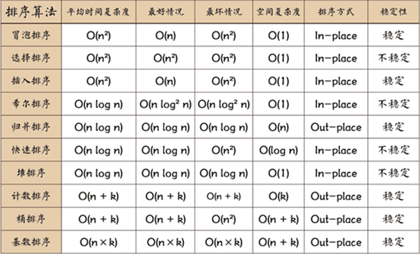

# C语言基础


## **gcc的编译过程**

gcc编译过程分为4个阶段：预处理、编译、汇编、链接。
预处理：头⽂件包含、宏替换、条件编译、删除注释
编译：主要进⾏词法、语法、语义分析等，检查⽆误后将预处理好的⽂件编译成汇编⽂件。
汇编：将汇编⽂件转换成 ⼆进制⽬标⽂件
链接：将项⽬中的各个⼆进制⽂件+所需的库+启动代码链接成可执⾏⽂件


## 数据类型

- char	    存储大小1字节，值范围-128~127
- int 		  32、64位系统存储大小4字节，值范围-2147483648~2147483647
- float	    存储大小4字节 
- double    存储大小8字节
- 指针        32位存储大小4字节，64位存储大小8字节


## 数组

### 静态数组和动态数组

静态数组：类似int arr[5];在程序运⾏就确定了数组的⼤⼩，运⾏过程不能更改数组的⼤⼩。
动态数组：主要是在堆区申请的空间，数组的⼤⼩是在程序运⾏过程中确定，可以更改数组的⼤⼩。

### 数组的初始化数值

不初始化：如果是局部数组，数组元素的内容随机；如果是全局数组，数组的元素内容为0
部分初始化：未被初始化的部分⾃动补0
完全初始化：如果⼀个数组全部初始化，可以省略元素的个数，数组的⼤⼩由初始化的个数确定

### 数组名

数组名作为类型：代表的是整个数组的⼤⼩(sizeof)
数组名作为地址：代表的是数组⾸元素的地址
对数组名取地址：代表的是数组的⾸地址


## **变量分类**

- 普通局部变量： 存在栈区、不初始化内容随机、只在定义所在的复合语句中有效、符合语句结束变量空间释放

- 普通全局变量 ：存在全局区、不初始化内容为0、进程结束空间才被释放，能被当前源⽂件或其他源⽂件使⽤，只是其他源⽂件使⽤的时候，记得使⽤extern修饰
- 静态局部变量： 存在全局区、不初始化内容为0、整个进程结束空间才被释放，只能在定义所在的复合语句中有效
- 静态全局变量 ：存在全局区、不初始化内容为0、整个进程结束空间才被释放，只能被当前源⽂件使⽤


## 指针

### 空类型指针

void*是空类型指针，又叫万能指针，就是该指针能接收任意类型的指针，可以指向任何类型对象，所以不能对空类型指针进行解引用，必须强制类型转换成相应的指针类型，才能进行解引用操作。

### 空指针

空指针变量具有空指针值，表示它处于闲置状态，没有指向任何有意义的内容  int * ptr = NULL

### 野指针

野指针指向的位置是随机的、不可知的、不正确的。指针末初始化或指针释放后末置空

### 数组指针和指针数组

普通指针  指针指向数组首元素地址 写法：int arr[5]; int* p = arr;
数组指针  指针指向整个数组的地址 写法：int arr[5]; int(*p)[5] = &arr;
指针数组  定义保存指针类型的数组连续空间，类似于二维数组的存放 写法：char *p[5]; p[1] = "asd"; p[2] = "aff";

### 函数指针和指针函数

函数指针  使用指针指向函数的地址，函数名出现表达式中可以代表函数基地址 写法：int (*p)(int,int); p = add;
指针函数  返回值为指针类型的函数  写法：int\* func(int a,int b);

### 常量指针和指针常量

常量指针  const修饰指针本身，表示指针本身无法进行修改指向的地址  写法：char* const p;
指针常量  const修饰指针指向的目标，表示无法通过指针修改对应地址的数据  写法：const char* p;


## 内存

### 内存分区

堆区、栈区、全局区（静态区）、⽂字常量区、代码区

### 内存的申请和释放

- malloc  在堆中开辟空间 如int* p=(int*)malloc(20);

- calloc    返回地址之前把申请的空间的每个字节初始化为全0 如int* p = (int*)calloc(NUM, sizeof(int));

- realloc  调整动态开辟的内存 如int* ptr = (int*)realloc(p, 40);

- free	  用来释放和回收动态内存，规避内存泄露


### 内存泄漏

内存泄漏是指程序在运行过程中由于错误或疏忽未能释放不再需要的内存，导致系统内存耗尽。当程序中的内存泄漏累积到一定程度时，可能导致程序性能下降甚至崩溃。使用 malloc()、calloc()、realloc() 动态分配的内存，如果没有指针指向它，就无法进行任何操作，这段内存会一直被程序占用，直到程序运行结束由操作系统回收。


## 文件IO

### 系统IO和标准IO

- 系统IO是Linux系统调用（内核API），而标准IO是C语言库函数；
- 系统IO不带缓冲，标准IO带有缓冲
- 系统IO操作的是文件描述符，标准IO操作的是流FILE
- 系统IO和标准IO所使用的的函数不同

### 文件描述符

文件描述符（File Descriptor）是操作系统中用于标识打开文件或其他I/O资源的整数值。文件描述符是一种抽象概念，它提供了对底层文件或I/O资源的访问。
文件描述符在使用时遵循以下原则：

- 文件描述符的获取：文件描述符可以通过打开文件或创建新的I/O资源时由操作系统分配获得。通常使用类似于`open`、`socket`等系统调用来获取文件描述符。
- 文件描述符的使用范围：文件描述符在进程的上下文中是唯一且有效的。不同进程的文件描述符可以相同，但在同一个进程中，每个打开的文件描述符都是唯一的。
- 文件描述符的传递：文件描述符可以通过进程间的通信机制（如管道、套接字等）在不同进程之间传递。这样，一个进程可以将打开的文件描述符传递给另一个进程，以实现文件共享或进行I/O操作。
- 文件描述符的关闭：在不再需要某个文件描述符时，应该及时将其关闭。关闭文件描述符可以通过调用`close`系统调用或相关的库函数来完成。关闭文件描述符会释放操作系统资源，并确保不再使用该文件描述符。

文件描述符的最大值取决于操作系统和文件系统的限制。在大多数Unix和类Unix系统中，文件描述符是非负整数，通常从0开始分配。最大文件描述符的值可以通过查询操作系统的相关限制来获得。在Linux系统中，可以通过`ulimit`命令或查询`RLIMIT_NOFILE`限制来获取最大文件描述符数。

### 标准IO的流

在标准输入输出（Standard I/O）中，流是一种抽象概念，用于描述程序与输入输出设备之间的交互。标准I/O流是指与标准输入（stdin）、标准输出（stdout）和标准错误（stderr）相关联的流。

- 标准输入流（stdin）用于接收输入数据，通常是用户从键盘输入的数据。程序可以从stdin流中读取数据，以便进行处理。
- 标准输出流（stdout）用于输出数据，通常是程序输出到屏幕上的数据。程序可以向stdout流写入数据，以便显示给用户。
- 标准错误流（stderr）用于输出错误信息，通常是程序在发生错误或异常情况时输出的信息。

### 阻塞IO和非阻塞IO

阻塞I/O：

- 在阻塞I/O模型中，当应用程序发起一个I/O操作（如读取或写入），它会等待该操作完成后再继续执行后续代码。
- 在进行阻塞I/O操作时，应用程序的执行被阻塞，直到I/O操作完成或达到超时时间。
- 阻塞I/O是一种同步的I/O模型，它会导致应用程序被阻塞在I/O操作上，无法进行其他任务。

非阻塞I/O：

- 在非阻塞I/O模型中，当应用程序发起一个I/O操作，如果操作可以立即完成，应用程序可以继续执行后续代码；如操作无法立即完成，程序会立即返回，应用程序会得到一个错误码或指示操作仍在进行中的状态，而不会等待该操作完成。
- 非阻塞I/O是一种异步的I/O模型，它允许应用程序在进行I/O操作的同时执行其他任务。

### IO多路复用

I/O多路复用（I/O Multiplexing）是一种用于实现高效的事件驱动I/O操作的技术。它允许单个线程同时监视多个I/O事件，从而避免了使用多线程或多进程来处理并发I/O操作的需要。
传统的阻塞I/O模型中，每个I/O操作都会导致线程或进程阻塞，直到该操作完成。这种模型在同时处理多个I/O操作时效率较低，因为每个I/O操作都需要一个独立的线程或进程。而使用I/O多路复用，可以通过一个阻塞的系统调用同时监视多个I/O事件，如读取数据、接受连接、发送数据等。常见的I/O多路复用机制包括select、poll和epoll。

### 多路复用之select、poll和epoll模型

select：

- select是最早出现的多路复用机制之一，可用于同时监视多个文件描述符是否有I/O事件发生。
- 在使用select时，需要创建并维护一个用于存放待监视文件描述符的数据结构，然后通过调用select函数来阻塞等待其中任何一个文件描述符上的事件发生。
- select函数会返回哪些文件描述符上有事件发生，然后应用程序可以遍历返回的结果进行相应的处理。
- select的一个限制是它使用的文件描述符集合有大小限制，通常是1024个。

poll：

- poll是对select的改进，也可用于同时监视多个文件描述符上的I/O事件。
- 与select不同，使用poll时无需创建和维护文件描述符集合，而是通过一个pollfd结构数组来表示待监视的文件描述符和事件。
- 调用poll函数时，它会阻塞等待任何一个文件描述符上的事件发生，并返回发生事件的文件描述符及其对应的事件类型。
- 它没有最大连接数的限制，原因是它是基于链表来存储的。

epoll：

- epoll是在Linux系统上引入的高性能多路复用机制，相对于select和poll有更好的扩展性和性能。
- epoll使用了事件驱动的方式，通过将文件描述符添加到内核管理的事件表中，当有事件发生时，内核会通知应用程序。
- epoll提供了三种I/O事件触发模式：边缘触发（EPOLLET）、水平触发（默认）和一次性触发（EPOLLONESHOT）。
- 边缘触发模式在事件发生时只通知一次，需要应用程序处理完整个事件；水平触发模式会在事件发生时持续通知，直到应用程序处理完事件。

### epoll之水平触发和边沿触发

水平触发（EPOLLLT）：

- 在水平触发模式下，当文件描述符上有可读或可写事件发生时，内核会持续通知应用程序。水平触发是epoll默认的工作模式。
- 如果应用程序没有立即处理事件，内核会继续通知该文件描述符上的事件，直到应用程序处理完事件或者应用程序停止监听该文件描述符。
- 水平触发适用于需要持续监视文件描述符上的事件的情况，即使应用程序没有立即处理事件。
-  缺点：当数据较大时，需要不断从用户态和内核态切换，消耗了大量的系统资源，影响服务器性能；

边沿触发（EPOLLET） ：

- 在边沿触发模式下，当文件描述符上有可读或可写事件发生时，内核只会通知应用程序一次。
- 不管应用程序是否立即处理事件，内核只会在事件发生时发送一次通知。如果应用程序没有及时处理事件，将不会再次收到通知，直到有新的事件发生。
- 边沿触发适用于需要及时响应文件描述符上的事件，且只关心事件是否发生的情况。
- 使用边沿触发模式时，应用程序需要确保尽快处理事件，并通过非阻塞方式读取或写入尽可能多的数据，以免错过事件。


# 数据结构

##  顺序表和链表

顺序表的特点：支持数据的连续存储，在内存上属于连续存储内存。优势在于可以通过下标索引号获取数据和修改数据
缺点： 大小固定，不容易修改，内存是连续不断的，若内存不足则无法操作

```c
//顺序表元素存储格式
struct Data
{
	int arr[MAX];		//数据域
	int count;		    //下标域
};
```

链表的特点：在内存上的存储是非连续的，数据元素之间是通过每个元素的指针来关联的。可以任意位置添加和删除元素，提高了内存的利用率

```c
//单链表元素存储格式
struct list
{
	int data;			    //数据域
	struct list *next;		//指针
};
```

## 二叉树的遍历

二叉树的遍历方式有三种：前序遍历、中序遍历和后序遍历。其中，前序遍历是指先访问根节点，然后依次递归访问左子树和右子树；中序遍历是指先递归访问左子树，然后访问根节点，最后递归访问右子树；后序遍历是指先递归访问左子树和右子树，最后访问根节点。

## 常见排序算法

- 冒泡排序	每次排序，比较相邻位置元素 交换位置
- 选择排序	每次排序，在未排序序列中找到最（小/大）元素，与未排序集合（末尾/起始）元素交换位置
- 插入排序	每次排序，将未排序集合中第一个数值取出，插入到已排序集合的相应的位置
- 快速排序	任取待排序元素序列中的某元素作为基准值，按照该排序码将待排序集合分割成两子序列，左子序列中所有元素均小于基准值，右子序列中所有元素均大于基准值，然后最左右子序列重复该过程，直到所有元素都排列在相应位置上为止。

## 排序算法复杂度对比




# 系统编程

## 进程

进程是计算机中的程序关于某数据集合上的一次运行活动，是系统进行资源分配的基本单位，是操作系统结构的基础。

### 进程相关函数

pid_t fork(void) //创建子进程（返回==0：创建的子进程对象 返回为>0: 当前子进程的父进程 返回为-1：创建子进程失败）
pid_t vfork(void) //创建子进程和阻塞父进程，vfork创建的子进程是优先父进程执行
pid_t getpid(void); //获取当前进程的id号
pid_t getppid(void);  //获取当前进程的父进程的ID号
void exit(int status);  //清空缓冲区，然后再退出,激活父进程
pid_t wait(int *status);  //监听子进程退出时候的状态 （返回：成功：退出的子进程的PID号 失败：返回-1）
pid_t waitpid(pid_t pid, int *status, int options);	

### 子进程写时拷贝

写时拷贝（Copy-on-Write，COW）是一种在创建子进程时用于减少内存复制开销的技术。它通过延迟对共享内存的复制，只有在需要修改内存时才进行实际的复制操作。
当父进程创建子进程时，操作系统会将父进程的内存空间完全复制到子进程的地址空间中。在传统的内存复制方式中，这个过程会消耗大量的时间和内存资源，尤其是当父进程的内存空间较大时。而使用写时拷贝技术时，父进程和子进程会共享相同的物理内存页。当父进程或子进程试图修改这些共享的内存页时，才会触发实际的内存复制操作。这样可以避免不必要的内存复制，减少了时间和内存开销。

### 僵尸进程、孤儿进程、守护进程

- 僵尸进程：如果子进程先退出，系统不会自动清理掉子进程的环境，而必须由父进程调用wait或waitpid函数来完成清理工作，如果父进程不做清理工作，则已经退出的子进程将成为僵尸进程，占用cpu资源
- 孤儿进程：当父子进程存在的时候，父进程提前退出，系统会指定祖宗进程为父进程，等待子进程执行完成，回收子进程的资源。
- 守护进程：又叫精灵进程和后台进程，守护进程只能通过kill命令发送杀死信号或者直接关闭系统可以销毁精灵进程，剩下的方式不会让精灵进程死亡，从操作系统启动的时候就开始创建，在操作系统关闭的时候结束对应的进程，他们不受其他的信号的管理，文件或者数据流的影响，一般用于记录当前系统的运行状态。精灵进程是运行在后台的一种特殊的进程，它独立于控制终端并且周期性的执行某种任务或者等待处理某些发生事件，不依赖用户输入就能提供某种服务。

### 进程间通讯方式

- 管道（pipe）：管道是一种半双工的通信方式，数据只能单向流动，而且只能在具有亲缘关系的进程间使用。进程的亲缘关系通常是指父子进程关系。 
- 有名管道（FIFO）：有名管道也是半双工的通信方式，但是它允许无亲缘关系进程间的通信。 
- 消息队列（MessageQueue）：消息队列是由消息的链表，存放在内核中并由消息队列标识符标识。消息队列克服了信号传递信息少、管道只能承载无格式字节流以及缓冲区大小受限等缺点。 
- 共享内存（SharedMemory）：共享内存就是映射一段能被其他进程所访问的内存，这段共享内存由一个进程创建，但多个进程都可以访问。共享内存是最快的 IPC 方式，它是针对其他进程间通信方式运行效率低而专门设计的。它往往与其他通信机制，如信号量，配合使用，来实现进程间的同步和通信。 
- 信号量（Semaphore）：信号量适用于多进程或者多线程之间的数据协调，可以用来控制多个进程对共享资源的访问。它常作为一种锁机制，防止某进程正在访问共享资源时，其他进程也访问该资源。因此，主要作为进程间以及同一进程内不同线程之间的同步手段。
- 套接字（Socket）：套接字也是一种进程间通信机制，与其他通信机制不同的是，它可用于不同及其间的进程通信。 
- 信号 (singal) ： 信号是一种比较复杂的通信方式，用于通知接收进程某个事件已经发生。


## 线程

线程是操作系统能够进行运算调度的最小单位。它被包含在进程之中，是进程中的实际运作单位。

### 线程相关函数

int pthread_create(pthread_t *thread, const pthread_attr_t *attr, void *(*start_routine) (void *), void *arg); //创建一个新线程
pthread_t pthread_self(void); //获取线程的id号
void pthread_exit(void *retval);  //结束一个线程
int pthread_join(pthread_t thread, void **retval);  //收回结束的线程资源

### 线程安全

线程安全是多个线程并发同一段代码时，不会出现不同的结果，我们就可以说该线程是安全的；
线程安全产生的原因：大多是因为对全局变量和静态变量的操作
如何实现：使用锁机制，原子操作，信号量

### 信号量

信号量（Semaphore）是一种经典的线程同步机制，用于控制对共享资源的访问数量。它基于一个计数器和两个原子操作（P操作和V操作）。

1. P操作（等待操作）：
   - 当线程需要访问共享资源时，首先执行P操作。
   - P操作会检查信号量的计数器。如果计数器大于0，则线程可以继续执行，并将计数器减1。
   - 如果计数器为0，则线程被阻塞，进入等待状态，直到有其他线程执行V操作增加计数器的值。
2. V操作（释放操作）：
   - 当线程使用完共享资源后，执行V操作来释放资源。
   - V操作会将信号量的计数器加1。
   - 如果有其他线程正在等待该信号量，其中一个等待的线程将被唤醒，并可以继续执行。

信号量的原理可以简单总结为：当计数器大于0时，线程可以继续执行，计数器减1。当计数器为0时，线程被阻塞，等待其他线程执行V操作唤醒它。

### 锁机制

- 互斥锁提供了以排他方式防止数据结构被并发修改的方法。 
- 读写锁允许多个线程同时读共享数据，而对写操作是互斥的。 
- 自旋锁让线程一直等待并不停的进行锁请求，直到得到这个锁为止。自旋锁的作用是为了解决某项资源的互斥使用。因为自旋锁不会引起调用者睡眠，所以自旋锁的效率远高于互斥锁。因此如果锁的内容较少，阻塞的时间较短，使用自旋锁比较好。
- 条件变量可以以原子的方式阻塞进程，直到某个特定条件为真为止。对条件的测试是在互斥锁的保护下进行的。条件变量始终与互斥锁一起使用。

### 死锁

死锁是指多个进程或线程因竞争资源而造成的一种僵局（互相等待），若无外力作用，这些进程都将无法向前推进。

死锁产生的原因 

1. 系统资源的竞争：系统资源的竞争导致系统资源不足，以及资源分配不当，导致死锁。 
2. 进程运行推进顺序不合适：进程在运行过程中，请求和释放资源的顺序不当，会导致死锁。

死锁的必要条件：

1. 互斥条件：一个资源每次只能被一个进程使用，即在一段时间内某资源仅为一个进程所占有。此时若有其他进程请求该资源，则请求进程只能等待。 
2. 请求与保持条件：进程已经保持了至少一个资源，但又提出了新的资源请求，而该资源已被其他进程占有，此时请求进程被阻塞，但对自己已获得的资源保持不放。 
3. 不可剥夺条件: 进程所获得的资源在未使用完毕之前，不能被其他进程强行夺走，即只能由获得该资源的进程自己来释放（只能是主动释放)。 
4. 循环等待条件: 若干进程间形成首尾相接循环等待资源的关系

避免死锁的方式

1. 避免循环等待：确保线程或进程在请求资源时不会形成循环等待。可以通过定义资源请求的顺序来避免循环等待，例如按照资源的编号或者按照固定的顺序获取资源。
2. 使用超时机制：在获取资源时，使用超时机制来避免无限等待资源的情况。如果等待超过一定的时间仍未获取到资源，可以放弃当前的申请或者进行其他处理。
3. 避免持有多个资源：尽量避免线程或进程同时持有多个资源。如果需要同时持有多个资源，可以使用资源分级和顺序获取的方式，减少死锁的可能性。
4. 避免死锁：使用资源分配和调度算法，避免资源分配的情况下形成死锁。例如，银行家算法（Banker's algorithm）可以用于避免死锁发生，通过动态分配资源来满足进程的请求，保证系统不会陷入死锁状态。

解决死锁问题：

1. 检测和恢复死锁：实现死锁检测算法，及时发现死锁的存在。一旦检测到死锁，可以采取相应的恢复措施来打破死锁状态。常见的死锁恢复方法包括终止某些线程或进程、回滚操作、释放资源等。
2. 强制解除死锁：在某些情况下，如果死锁发生的概率非常低，或者死锁的代价非常高，可以采取强制解除死锁的策略。这涉及到终止所有死锁的线程或进程，并释放它们占用的资源，从而解除死锁状态。

### 进程和线程对比

- 定义的区别：
  进程：具有一个独立功能的程序，拥有独立的内存空间
  线程： 它是比进程更小的能独立运行的基本单位，线程本身是不拥有系统资源的，它和属于同一个进程的其他线程共享进程中所有资源内容。
- 调用区别：
  进程：拥有资源(管理资源、分配资源)的基本单位
  线程：调用和分派任务的基本的单位
- 共享地址空间：
  进程：拥有各自独立的地址空间、资源, 所以共享复杂,需要使用IPC（进程间通信）,但是同步简单
  线程：共享所属进程的资源，因此共享简单，但是同步复杂，需要用锁特性加持
- 占用内存和cpu
  进程：占用内存多，切换复杂，cpu利用率较低
  线程：占用内存少，切换简单，cpu利用率较高
- 互相影响
  进程：进程之间不会相互影响，内存地址独立
  线程：一个线程无故挂掉，可能导致整个进程挂掉


# 网络编程

## OSI模型和TCP/IP协议

OSI网络模型有七层模型：分别是应用层、表示层、会话层、传输层、网络层、数据链路层和物理层。
目前广泛使用的是 TCP/IP协议族网络四层模型：从上往下依次是应用层、传输层、网际层和网络接口层。

## TCP与UDP传输层通信协议

- TCP是面向连接的，UDP是无连接的 
- TCP是可靠的，UDP是不可靠的 
- TCP是面向字节流的，UDP是面向数据报文的
-  TCP只支持点对点通信，UDP支持一对一，一对多，多对多 
- TCP有拥塞控制机制，UDP没有 
- TCP协议下双方发送接受缓冲区都有，UDP并无实际意义上的发送缓冲区，但是存在接受缓冲区

## TCP三次握手和四次挥手  

三次握手： 

1. 客户端发起连接，发送一个SYN报文给服务端，然后说明自己连接的端口和客户端初始序列号 seq1。  
2. 服务端收到SYN报文，也需要发起反方向的连接，所以发送一个SYN报文给服务端，说明自己连接的端口和服务端初始序列号seq2，除此以外，这个报文还可以携带一个确认信息，所以把seq1+1 作为ACK返回。 
3. 客户端收到服务端的SYN之后，需要确认，所以把seq2+1作为ACK返回给服务端。 

四次挥手： 

1. 主动关闭方发送一个FIN段表示希望断开连接。  
2. 被动关闭方收到FIN段，并且回复一个确认信息。其上层应用会收到一个EOF，被动关闭方继续传输剩余的数据。 
3. 被动关闭方发送完数据了，发送一个FIN段。   
4. 主动关闭方回复一个确认，并且等待一段时间（2MSL，MSL指单个报文在网络中的最长生存时间）。

## TCP 网络编程流程

```c
//服务端
//1.建立TCP连接，创建Socket文件描述符fd(sockfd)，即建立通信端点 socket
int sockfd = socket(AF_INET, SOCK_STREAM, 0);
if(-1 == sockfd)
{
    fprintf(stderr, "line[%d] socket failed\n", __LINE__);
    return -1;
}
else
{
    printf("成功申请套接字为：%d\n", sockfd);
}

//2.绑定套接字文件描述符sockfd与网络地址和端口号，即ip地址+端口号 bind
//初始化IP地址和端口的结构体
struct sockaddr_in ServerAddr; 	//定义结构体对象
memset(&ServerAddr, 0, sizeof(ServerAddr)); //清空操作
ServerAddr.sin_family = AF_INET; //协议族
ServerAddr.sin_port = htons(atoi(argv[1])); //设置端口号
ServerAddr.sin_addr.s_addr = htonl(INADDR_ANY); //接收任意的IP地址
int ret = bind(sockfd, (struct sockaddr *)&ServerAddr, sizeof(ServerAddr));
if(-1 == ret)
{
    fprintf(stderr, "line[%d] bind failed\n", __LINE__);
    return -1;
}

//3.设置套接字进入被动监听状态，即设置套接字的监听 listen
listen(sockfd, 1);

//4.等待客户端连接服务器，发起连接请求 accept
struct sockaddr_in ClientAddr; 	//定义结构体对象
memset(&ClientAddr, 0, sizeof(ClientAddr)); //清空操作

socklen_t len = sizeof(ClientAddr);
int confd = accept(sockfd, (struct sockaddr *)&ClientAddr, &len);
if(-1 == confd)
{
    fprintf(stderr, "line[%d] accept failed\n", __LINE__);
    return -1;
}
printf("连接成功的套接字%d\n", confd);

//5.收到连接请求，获取客户端的连接套接字confd，用于数据的接收和发送 recv/send
char buf[128];
for(;;)
{
    memset(buf, 0, sizeof(buf)); //清空buf
    read(confd, buf, sizeof(buf)); //接收连接成功套接字的数据
    printf("[%s]客户端发送的内容为:%s", inet_ntoa(ClientAddr.sin_addr), buf);

    if(!strcmp(buf, "byebye\n"))
        break;
}

//6.关闭服务端对象 close
close(sockfd);


//客户端
//1.建立TCP套接字，创建sockfd，即建立通信端点 Socket
int sockfd = socket(AF_INET, SOCK_STREAM, 0);
if(-1 == sockfd)
{
    fprintf(stderr, "line[%d] socket failed\n", __LINE__);
    return -1;
}
else
{
    printf("成功申请套接字为：%d\n", sockfd);
}

//2.对服务端发送请求connect，同步配置ip地址和端口
struct sockaddr_in ServerAddr;
memset(&ServerAddr, 0, sizeof(ServerAddr));
ServerAddr.sin_family = AF_INET; //协议族
ServerAddr.sin_port = htons(atoi(argv[2])); //设置端口号
ServerAddr.sin_addr.s_addr = inet_addr(argv[1]); //IPV4的地址
//启动连接服务器
connect(sockfd, (struct sockaddr *)&ServerAddr, sizeof(ServerAddr));

//3.请求连接成功，通过套接字sockfd进行数据的接收和发送 recv/send
char buf[128];
for(;;)
{
    memset(buf, 0, sizeof(buf)); //清空数组
    printf("请输入发送的内容\n");
    fgets(buf, sizeof(buf), stdin);
    write(sockfd, buf, strlen(buf)); //发送消息给Server
    if(!strcmp(buf, "byebye\n"))
    {
        break;
    }
}

//4.关闭客户端对象 close
close(sockfd);
```


# C++ 基础

## C++ 特性

### 命名空间

C++中的命名空间（Namespace）是一种用于避免命名冲突和组织代码的机制。命名空间可以将相关的变量、函数、类等实体封装在一个逻辑上的作用域内，以便在程序中进行引用和访问。


### 内联函数和宏定义

内联函数：

- 内联函数是一种函数定义的方式，在函数调用处直接将函数体插入，而不是通过函数调用的方式执行。
- 内联函数通常是通过在函数定义前加上`inline`关键字来声明的。
- 内联函数的目的是为了减少函数调用的开销，提高程序的执行效率。
- 内联函数在编译时展开，因此可以避免函数调用的开销，但会增加代码的大小。
- 内联函数适用于函数体较小且频繁调用的情况。

宏定义：

- 宏定义是一种文本替换的机制，使用预处理器（Preprocessor）将宏定义的标识符替换为相应的文本。
- 宏定义使用`#define`指令来定义，可以定义常量、函数或复杂的代码片段。
- 宏定义是简单的文本替换，没有函数的调用开销，但也没有类型检查等编译时的安全性保证。
- 宏定义在预处理阶段就完成了替换，不会增加代码的大小。
- 宏定义适用于需要进行简单的文本替换的场景。


### 引用和指针

引用：

- 引用是一个已存在对象的别名，用于直接访问该对象。
- 引用必须在定义时进行初始化，并且一旦初始化后，它将一直引用同一个对象，无法改变引用的目标。
- 引用使用的语法是在变量名前加上`&`符号进行声明，并且在使用时无需使用`*`符号进行解引用。
- 引用可以被看作是对象的一个别名，对引用的操作就是对目标对象的操作。

指针：

- 指针是一个变量，存储了一个对象的内存地址。
- 指针可以指向任何类型的对象，包括基本类型、自定义类型、函数等。
- 指针使用的语法是在变量名前加上`*`符号进行声明，并且在使用时需要使用`*`符号进行解引用，以访问指针指向的对象。
- 指针可以改变指向的对象，即可以修改指针的值来指向不同的对象。

引用和指针之间的区别：

- 引用必须在定义时进行初始化，而指针可以先声明，后赋值。
- 引用一旦初始化后，无法改变引用的目标，而指针可以通过修改指针的值来指向不同的对象。
- 引用不存在空引用的概念，必须引用一个已存在的对象，而指针可以为空指针（nullptr）。
- 引用不需要使用解引用符号就可以访问对象，而指针需要使用解引用符号。
- 引用没有自己的内存地址，而指针有自己的内存地址。

在使用引用和指针时，需要根据具体的需求和情况来选择合适的方式。引用通常用于函数参数传递、返回值、遍历容器等场景，而指针则更灵活，可以动态地分配和释放内存，处理数组和复杂的数据结构等。

### new、delete和malloc、free

- `new`和`delete`是C++关键字，而`malloc`和`free`是C语言函数。
- `new`和`delete`会调用对象的构造函数和析构函数来进行初始化和清理，而`malloc`和`free`不会。
- `new`和`delete`可以用于动态分配单个对象和数组，而`malloc`和`free`只能用于动态分配指定字节数的内存。
- `malloc`返回的是`void*`类型的指针，需要进行类型转换，而`new`返回的是指定类型的指针。
- `new`和`delete`在内存分配失败时会抛出异常（C++异常处理机制），而`malloc`在分配失败时返回`NULL`。


## C++ 面向对象

### 面向对象的特性

- 封装（Encapsulation）: 封装是将数据和操作数据的方法封装在类中的机制。通过使用访问修饰符（如公有、私有和保护）来限制对类的成员的访问，实现了封装的概念。封装提供了数据隐藏和信息隐藏的特性。
- 继承（Inheritance）: 继承是一种通过建立类之间的关系来实现代码重用和扩展的机制。子类（派生类）可以继承父类（基类）的属性和方法，并可以添加自己的特定属性和方法。继承支持单继承和多继承。
- 多态（Polymorphism）: 多态是一种允许使用相同的接口来处理不同的对象类型的能力。通过多态，可以在运行时根据对象的实际类型来调用适当的方法，实现了多态性。多态性提供了代码的灵活性和可扩展性。

### 类和对象

类是面向对象编程的基本构建单元，它封装了数据和操作数据的方法。类定义了对象的属性和行为，并定义了对象的初始状态和操作。
对象是类的实例，通过创建类的对象来使用类的属性和方法。对象具有类定义的属性和行为，并可以通过方法调用来操作数据。

### 重载和重写

重载（Overloading）：

- 重载是指在同一个作用域内，使用相同的函数名但具有不同的参数列表或参数类型，来定义多个功能类似但参数不同的函数。
- 重载函数可以根据传入的参数类型或参数个数来决定使用哪个函数，实现了函数名的多态性。
- 重载函数的返回类型可以相同也可以不同，但仅根据返回类型是无法区分重载函数的。

重写（Overriding）：

- 重写是指在派生类中重新定义基类的虚函数，以改变或扩展基类虚函数的行为。
- 重写函数在基类和派生类中具有相同的函数名、参数列表和返回类型，并且基类中对应的函数必须声明为虚函数。
- 当通过基类指针或引用调用虚函数时，实际调用的是派生类中重写的函数，实现了运行时的多态性。

### 子类构造函数和析构函数

**与父类构造函数和析构函数执行顺序**

在C++中，当子类的对象创建时，会依次调用父类的构造函数和子类的构造函数。当子类的对象销毁时，会依次调用子类的析构函数和父类的析构函数。

**显式调用父类构造函数和析构函数**

子类的构造函数和析构函数可以显式调用父类的构造函数和析构函数，以确保父类的构造和析构逻辑被正确执行。
子类构造函数显式调用父类构造函数：

- 在子类的构造函数中，可以使用初始化列表（initializer list）来显式调用父类的构造函数。
- 初始化列表使用冒号（:）后跟父类构造函数的调用语法：父类名(参数列表)。
- 在初始化列表中调用父类构造函数可以在子类构造函数执行之前初始化父类的成员。

子类析构函数显式调用父类析构函数：

- 在子类的析构函数中，可以显式调用父类的析构函数，以确保父类的析构逻辑被执行。
- 在子类析构函数中，使用父类名::~父类名() 的语法来显式调用父类的析构函数。

```c
class Parent {
public:
    Parent(int value) {
        cout << "Parent constructor called with value: " << value << endl;
    }
    
    ~Parent() {
        cout << "Parent destructor called" << endl;
    }
};

class Child : public Parent {
public:
    Child(int value) : Parent(value) {
        cout << "Child constructor called with value: " << value << endl;
    }
    
    ~Child() {
        cout << "Child destructor called" << endl;
        Parent::~Parent();  // 显式调用父类析构函数
    }
};

int main() {
    Child obj(10);  // 创建子类对象，调用子类和父类的构造函数
}
```

### 虚函数和纯虚函数

虚函数（Virtual Function）：

- 虚函数是在基类中声明为虚函数的成员函数。
- 虚函数通过使用关键字`virtual`进行声明，并在基类中定义。
- 子类可以重写（override）基类的虚函数，以实现多态性。
- 虚函数通过基类指针或引用调用时，根据实际对象的类型来确定调用的是基类的虚函数还是子类的重写函数。

纯虚函数（Pure Virtual Function）：

- 纯虚函数是在基类中声明为纯虚函数的虚函数。
- 纯虚函数通过在基类中使用`virtual`关键字声明，并赋值为0来定义。
- 带有纯虚函数的类称为抽象类，不能实例化对象。
- 子类必须实现（override）基类的纯虚函数，才能成为具体的类。
- 纯虚函数可以为基类提供一个接口，要求派生类必须实现相应的功能。


# C++ QT

